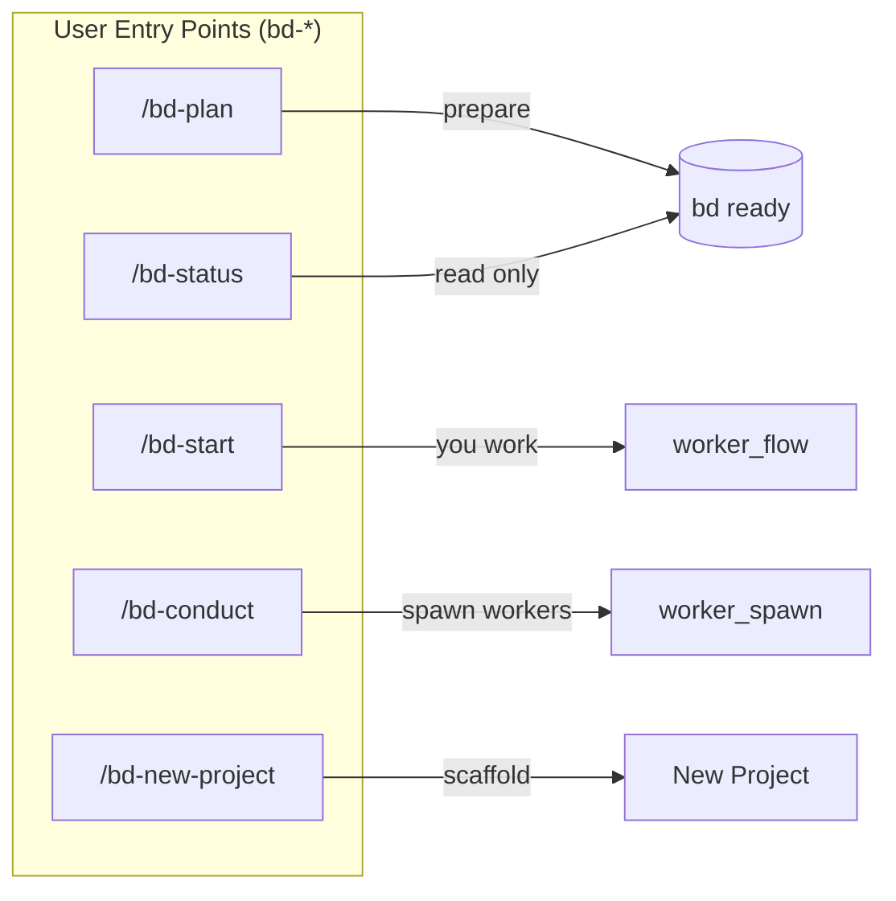
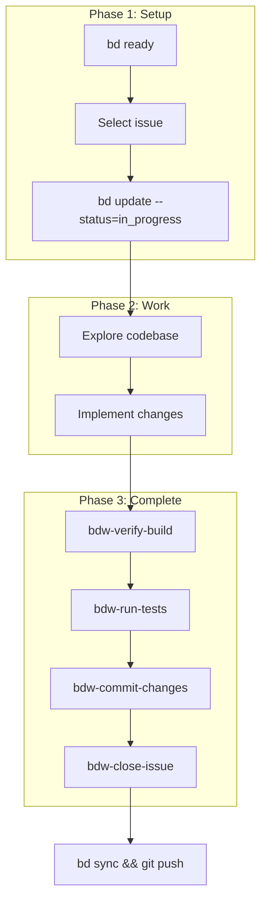
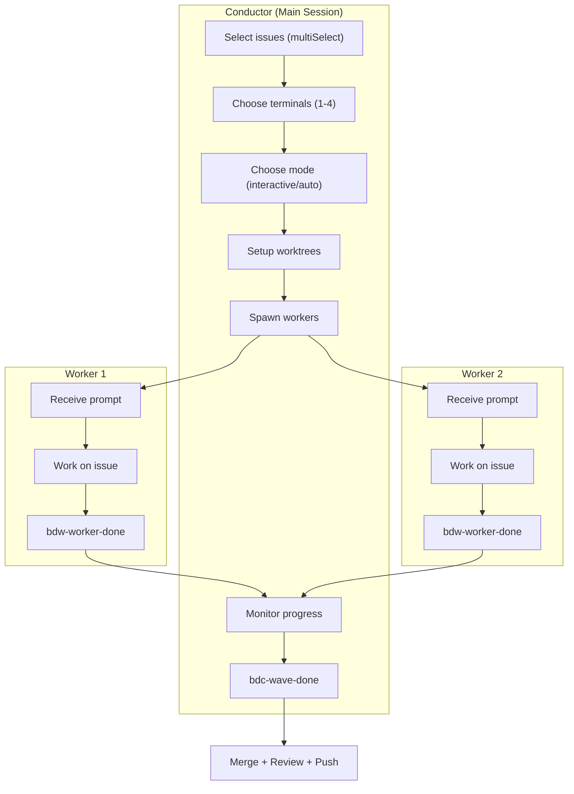
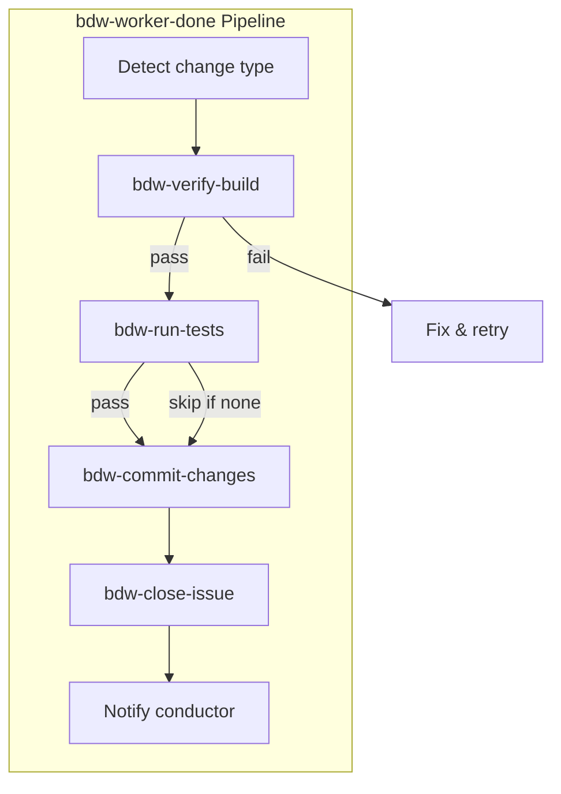
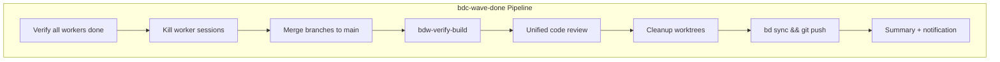
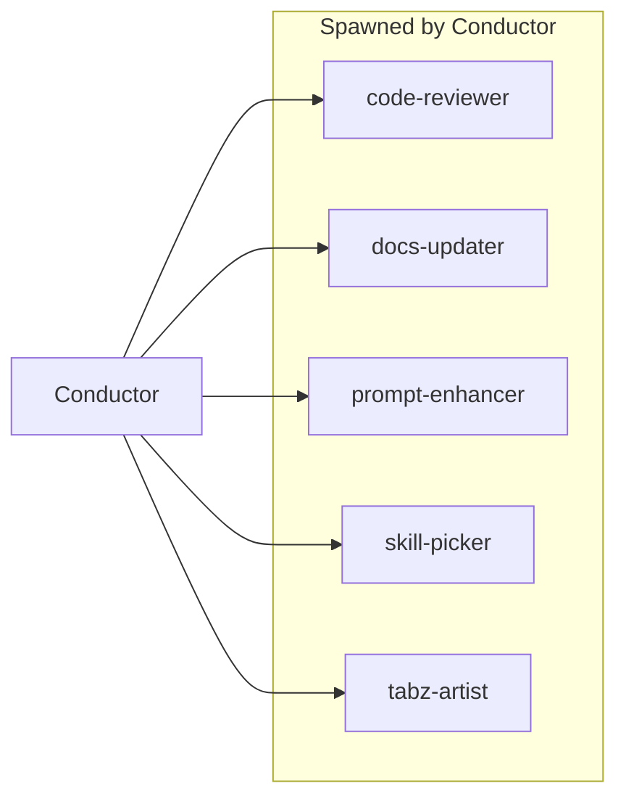

# Conductor Architecture

Visual workflow diagrams with clickable skill references.

## Entry Points



---

## Standalone Workflow (bd-start)

When YOU work directly on an issue (no worker spawn).



### Skills in this workflow

| Step | Skill | Purpose |
|------|-------|---------|
| Verify | [bdw-verify-build](skills/bdw-verify-build/SKILL.md) | Run build, report errors |
| Test | [bdw-run-tests](skills/bdw-run-tests/SKILL.md) | Run tests if available |
| Commit | [bdw-commit-changes](skills/bdw-commit-changes/SKILL.md) | Stage + conventional commit |
| Close | [bdw-close-issue](skills/bdw-close-issue/SKILL.md) | Close beads issue |

---

## Multi-Worker Workflow (bd-conduct)

Interactive orchestration spawning 1-4 workers.



### Conductor Skills (bdc-*)

| Skill | Purpose | When Used |
|-------|---------|-----------|
| [bdc-orchestration](skills/bdc-orchestration/SKILL.md) | Multi-session coordination patterns | During spawning |
| [bdc-swarm-auto](skills/bdc-swarm-auto/SKILL.md) | Autonomous waves until backlog empty | Auto mode |
| [bdc-wave-done](skills/bdc-wave-done/SKILL.md) | Merge branches, unified review, cleanup | After all workers complete |
| [bdc-run-wave](skills/bdc-run-wave/SKILL.md) | Run wave from molecule template | Template-based execution |
| [bdc-analyze-transcripts](skills/bdc-analyze-transcripts/SKILL.md) | Review worker session transcripts | Post-mortem |

---

## Worker Completion Pipeline (bdw-worker-done)

What happens when a worker finishes their task.



### Worker Skills (bdw-*)

| Skill | Purpose | Atomic? |
|-------|---------|---------|
| [bdw-worker-init](skills/bdw-worker-init/SKILL.md) | Initialize worker context | No |
| [bdw-worker-done](skills/bdw-worker-done/SKILL.md) | Full completion pipeline | No (orchestrator) |
| [bdw-verify-build](skills/bdw-verify-build/SKILL.md) | Run build, report errors | Yes |
| [bdw-run-tests](skills/bdw-run-tests/SKILL.md) | Run tests if available | Yes |
| [bdw-code-review](skills/bdw-code-review/SKILL.md) | Opus review with auto-fix | Yes |
| [bdw-codex-review](skills/bdw-codex-review/SKILL.md) | Cost-effective GPT review | Yes |
| [bdw-commit-changes](skills/bdw-commit-changes/SKILL.md) | Stage + commit | Yes |
| [bdw-close-issue](skills/bdw-close-issue/SKILL.md) | Close beads issue | Yes |
| [bdw-create-followups](skills/bdw-create-followups/SKILL.md) | Create follow-up issues | Yes |
| [bdw-update-docs](skills/bdw-update-docs/SKILL.md) | Update documentation | Yes |

---

## Wave Completion (bdc-wave-done)

After all workers finish, conductor runs unified completion.



---

## Agents (Spawnable Subagents)

Agents are spawned via Task tool for isolated work.



| Agent | Model | Purpose |
|-------|-------|---------|
| [conductor](agents/conductor.md) | Opus | Main orchestration |
| [code-reviewer](agents/code-reviewer.md) | Sonnet | Autonomous code review |
| [docs-updater](agents/docs-updater.md) | Opus | Update documentation |
| [prompt-enhancer](agents/prompt-enhancer.md) | Haiku | Optimize worker prompts |
| [skill-picker](agents/skill-picker.md) | Haiku | Find/install skills |
| [tabz-artist](agents/tabz-artist.md) | Sonnet | Visual asset generation |
| [silent-failure-hunter](agents/silent-failure-hunter.md) | Sonnet | Error handling audit |

---

## File Structure Map

```
plugins/conductor/
├── ARCHITECTURE.md          ← You are here
├── plugin.json
│
├── commands/                ← User entry points (visible in / menu)
│   ├── bd-plan.md
│   ├── bd-start.md
│   ├── bd-status.md
│   ├── bd-conduct.md
│   └── bd-new-project.md
│
├── skills/                  ← Workflow steps (hidden: user-invocable: false)
│   ├── bdc-orchestration/   ┐
│   ├── bdc-swarm-auto/      │ Conductor internal
│   ├── bdc-wave-done/       │
│   ├── bdc-run-wave/        │
│   ├── bdc-analyze-transcripts/ ┘
│   │
│   ├── bdw-worker-init/     ┐
│   ├── bdw-worker-done/     │
│   ├── bdw-verify-build/    │
│   ├── bdw-run-tests/       │ Worker steps
│   ├── bdw-code-review/     │
│   ├── bdw-codex-review/    │
│   ├── bdw-commit-changes/  │
│   ├── bdw-close-issue/     │
│   ├── bdw-create-followups/│
│   ├── bdw-update-docs/     ┘
│   │
│   ├── tabz-mcp/            ┐
│   ├── tabz-artist/         │ Special capabilities
│   └── terminal-tools/      ┘
│
├── agents/                  ← Spawnable subagents
│   ├── conductor.md
│   ├── code-reviewer.md
│   ├── docs-updater.md
│   ├── prompt-enhancer.md
│   ├── skill-picker.md
│   ├── tabz-artist.md
│   └── silent-failure-hunter.md
│
└── scripts/                 ← Shell automation
    ├── setup-worktree.sh
    ├── match-skills.sh
    ├── discover-skills.sh
    ├── completion-pipeline.sh
    ├── wave-summary.sh
    ├── capture-session.sh
    └── lookahead-enhancer.sh
```

---

## Quick Reference

### Prefix Taxonomy

| Prefix | Meaning | Visible in Menu |
|--------|---------|-----------------|
| `bd-*` | User entry points | Yes |
| `bdc-*` | Conductor internal | No |
| `bdw-*` | Worker steps | No |

### Workflow Selection

| Scenario | Use |
|----------|-----|
| Work on 1 issue yourself | `/conductor:bd-start` |
| Spawn workers for issues | `/conductor:bd-conduct` |
| Prepare backlog first | `/conductor:bd-plan` |
| Check project status | `/conductor:bd-status` |
| Fully autonomous | `/conductor:bdc-swarm-auto` |
